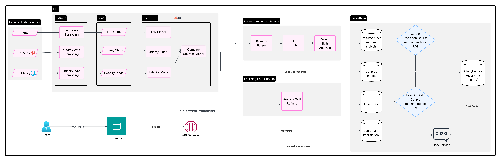

# SkillPathAI


## Overview
SkillPathAI is a career transition and skill development platform that helps users navigate their professional journey. The platform provides personalized learning paths and career guidance through an intuitive web interface.

## Architecture Diagram


## Project Architecture
```
SkillPathAI/
├── frontend/          # Streamlit-based web application
│   ├── assets/        # Static assets (images, icons)
│   ├── components/    # Reusable UI components
│   ├── logs/         # Application logs
│   ├── .streamlit/   # Streamlit configuration
│   ├── auth_page.py  # Authentication pages
│   ├── career_transition_page.py  # Career transition features
│   ├── courses_page.py  # Course management
│   ├── dashboard.py  # Main dashboard logic
│   ├── dashboard_page.py  # Dashboard UI
│   ├── guidance_hub_page.py  # Guidance and support
│   ├── learning_path_page.py  # Learning path management
│   ├── main.py      # Application entry point
│   ├── profile_page.py  # User profile management
│   ├── styles.css   # Custom styling
│   └── ui_formatter.py  # UI formatting utilities
│
├── backend/          # FastAPI-based backend services
│   ├── api/         # API endpoints
│   ├── services/    # Business logic
│   ├── logs/        # Application logs
│   ├── database.py  # Database configuration
│   └── requirements.txt  # Backend dependencies
│
├── docker/          # Docker configuration
│   ├── Dockerfile   # Docker build instructions
│   ├── docker-compose.yml  # Service orchestration
│   ├── DOCKER_README.md    # Docker setup guide
│   └── .dockerignore       # Docker ignore rules
│
├── Deployment/      # Deployment scripts
│   └── docker-run.sh  # Script for building and running Docker containers
│
└── etl/            # ETL pipeline
    ├── extract/    # Data extraction
    ├── transform/  # Data transformation
    ├── load/       # Data loading
    ├── Cortex_Queries/  # Snowflake queries
    └── main.py     # ETL orchestration
```

## Features

### Frontend Features
- **Authentication System**
  - User Login
  - User Registration
  - Password Recovery
  - Secure Session Management

- **Dashboard**
  - Personalized user dashboard
  - Career transition insights
  - Learning path recommendations
  - Progress tracking

- **Career Transition Tools**
  - Career path analysis
  - Skill gap assessment
  - Transition planning
  - Job market insights

- **Learning Path Management**
  - Course recommendations
  - Skill development tracking
  - Progress monitoring
  - Personalized learning plans

### ETL Pipeline
- **Data Sources**
  - Udemy courses
  - Coursera courses
  - edX courses
  - Udacity courses
  - Pluralsight courses

- **Data Processing**
  - Data extraction from Kaggle
  - Data transformation
  - Data loading to Snowflake
  - Automated pipeline execution

## Technical Stack

### Frontend
- **Framework**: Streamlit 1.43.2
- **Data Processing**: Pandas 2.0.3, NumPy 1.24.3
- **Styling**: Custom CSS
- **API Integration**: Requests 2.31.0
- **Environment Management**: python-dotenv 1.0.0
- **State Management**: Streamlit Session State
- **Logging**: Python logging module

### Backend
- **Framework**: FastAPI 0.115.12
- **Server**: Uvicorn 0.34.2
- **Database**: Snowflake (via snowflake-connector-python 3.13.2)
- **Data Processing**: Pandas 2.0.3, NumPy 1.24.3
- **File Handling**: python-multipart 0.0.9
- **Environment Management**: python-dotenv 1.0.0
- **API Integration**: Requests 2.31.0

### Infrastructure
- **Containerization**: Docker
- **Orchestration**: Docker Compose
- **Resource Management**: Memory limits and reservations
- **Auto-restart**: Failure recovery with max attempts
- **Volume Mounts**: Development-friendly file mounting

## Getting Started

### Prerequisites
- Python 3.9+
- Docker and Docker Compose
- Snowflake account and credentials
- Streamlit (for frontend development)

### Installation

#### Option 1: Docker Setup
1. Clone the repository:
   ```bash
   git clone https://github.com/yourusername/SkillPathAI.git
   cd SkillPathAI
   ```

2. Make the docker-run.sh script executable:
   ```bash
   chmod +x Deployment/docker-run.sh
   ```

3. Run the application using the docker-run.sh script:
   ```bash
   ./Deployment/docker-run.sh
   ```
   This script will:
   - Check if required ports (8501 and 8000) are available
   - Build and start the Docker containers
   - Set up environment variables for Snowflake
   - Provide URLs for accessing the application
   - Handle cleanup when you stop the script (Ctrl+C)

   Note: The script will use default Snowflake credentials if not specified. To use your own credentials, you can either:
   - Edit the script and modify the default values
   - Set the environment variables before running the script:
     ```bash
     export SNOWFLAKE_ACCOUNT="your_account"
     export SNOWFLAKE_USER="your_user"
     export SNOWFLAKE_PASSWORD="your_password"
     export SNOWFLAKE_WAREHOUSE="your_warehouse"
     export SNOWFLAKE_DATABASE="your_database"
     export SNOWFLAKE_SCHEMA="your_schema"
     ./Deployment/docker-run.sh
     ```

4. Access the application:
   - Frontend: http://localhost:8501
   - Backend API: http://localhost:8000

#### Option 2: Manual Setup
1. Clone the repository:
   ```bash
   git clone https://github.com/yourusername/SkillPathAI.git
   cd SkillPathAI
   ```

2. Set up environment variables:
   Create a `.env` file in both frontend and backend directories with necessary credentials

3. Install frontend dependencies:
   ```bash
   cd frontend
   pip install -r requirements.txt
   ```

4. Install backend dependencies:
   ```bash
   cd backend
   pip install -r requirements.txt
   ```

5. Start the backend server:
   ```bash
   cd backend
   uvicorn main:app --reload
   ```

6. Start the frontend:
   ```bash
   cd frontend
   streamlit run main.py
   ```

### ETL Pipeline Setup
1. Navigate to the etl directory:
   ```bash
   cd etl
   ```

2. Install required dependencies:
   ```bash
   pip install -r requirements.txt
   ```

3. Run the ETL pipeline:
   ```bash
   python main.py
   ```

## Development Workflow

### Frontend Development
1. Navigate to the frontend directory
2. Install dependencies:
   ```bash
   pip install -r requirements.txt
   ```
3. Run the development server:
   ```bash
   streamlit run main.py
   ```

### Backend Development
1. Navigate to the backend directory
2. Install dependencies:
   ```bash
   pip install -r requirements.txt
   ```
3. Run the development server:
   ```bash
   uvicorn main:app --reload
   ```

## Contributing
1. Fork the repository
2. Create a feature branch
3. Commit your changes
4. Push to the branch
5. Create a Pull Request

## Contact
- Project Members: [Sangram, Anusree, Divya]

